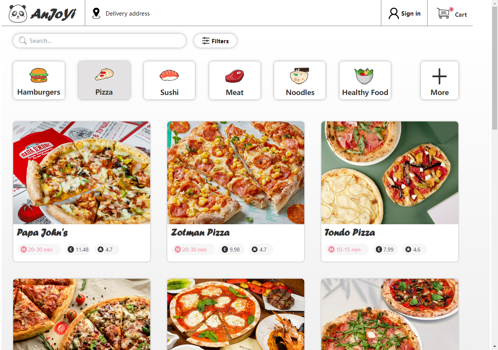
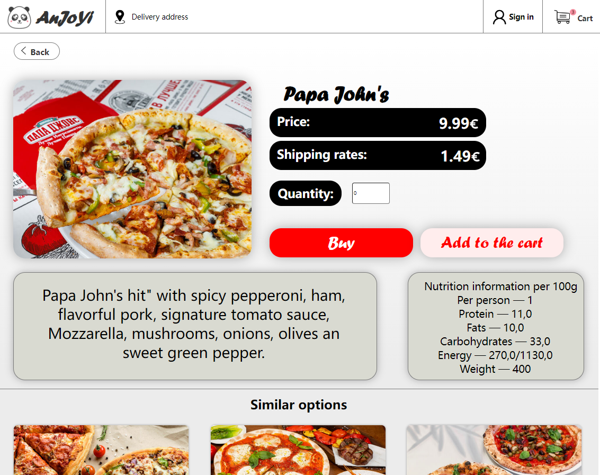
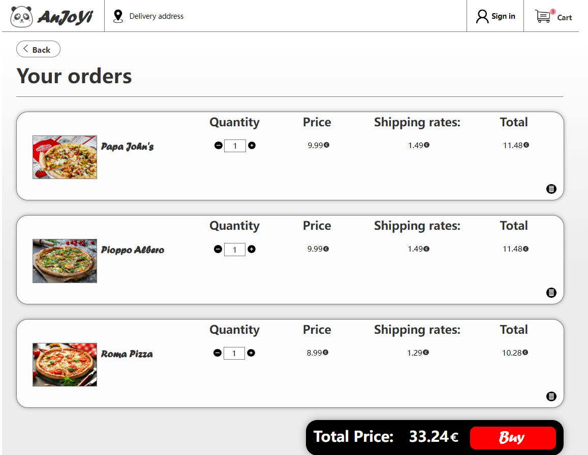

# HTML-CSS-project

# Description

This is a group project from my first year at Oulu University of Applied Sciences. This project is a static website for a takeaway service built totally using HTML and CSS, and it provides as a great opportunity for me to improve my HTML and CSS skills.

# The applied technologies

## Front End

- **HTML**
- **CSS**

# Usage
Open the homepage.html file after cloning the code repository.
